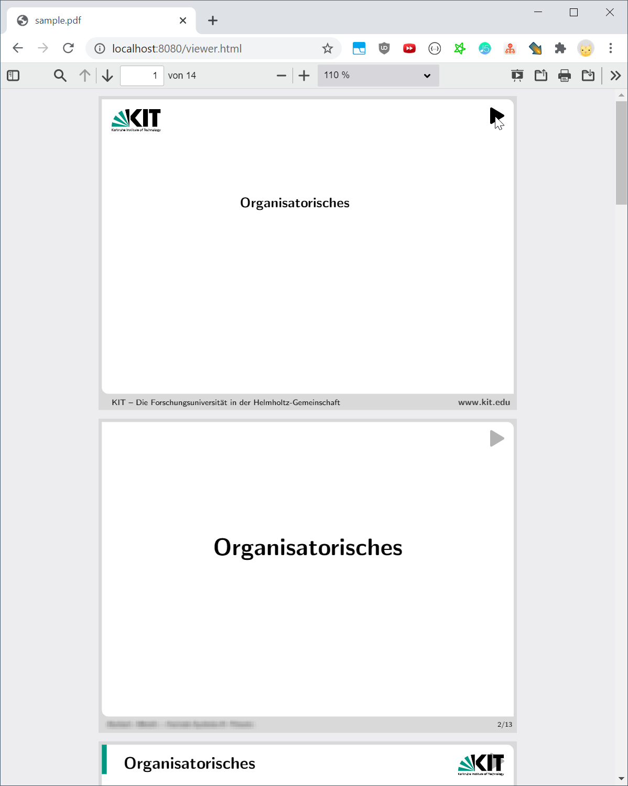

# Customizable PDF.js Viewer

[](https://github.com/sponsors/hediet)
[](https://www.paypal.com/cgi-bin/webscr?cmd=_s-xclick&hosted_button_id=ZP5F38L4C88UY&source=url)
[](https://twitter.com/intent/follow?screen_name=hediet_dev)

This package makes the PDF.js viewer available to third party applications.
The viewer can be customized easily. Works best with webpack.

**Please don't report issues of the PDF.js viewer bundled with this library on the PDF.js repository, as they might be caused by modifications of this library!**

Also, please rebrand the viewer as requested by PDF.js, so that users don't mistake this build for Firefox's pdf viewer.

## Usage (Webpack)

I recommend to host the viewer in its own `iframe`, otherwise style and id conflicts might occur.

First, install the npm package:
```sh
yarn add @hediet/pdfjs-viewer
```

Then, setup the viewer entry (`viewer.ts`):
```ts
import "@hediet/pdfjs-viewer/dist/assets/viewer.css";
import { loadViewer } from "@hediet/pdfjs-viewer";
loadViewer({ pdfUrl: "/sample.pdf" });
```

This webpack config is recommended:
```ts
import * as webpack from "webpack";
import path = require("path");
import HtmlWebpackPlugin = require("html-webpack-plugin");
import CopyWebpackPlugin = require("copy-webpack-plugin");

const r = (file: string) => path.resolve(__dirname, file);

module.exports = {
	output: { path: r("dist"), },

	// Add your own entry point and the viewer entry point
	entry: { main: r("src/index.ts"), viewer: r("src/viewer.ts") },

	plugins: [
		new CopyWebpackPlugin({ patterns: [{ from: r('../dist/assets') },] }),
		// Setup an `index.html`
		new HtmlWebpackPlugin({ chunks: ["main"], }),
		// And a `viewer.html` that uses the viewer entry point.
		new HtmlWebpackPlugin({ chunks: ["viewer"], filename: "viewer.html", }),
	],
	resolve: {
		extensions: [".webpack.js", ".web.js", ".ts", ".tsx", ".js"],
	},
	devtool: "source-map",
	module: {
		rules: [
			{ test: /\.tsx?$/, loader: "ts-loader", options: { transpileOnly: true }, },
			{ test: /\.css$/, use:["style-loader", "css-loader"] },
			{ test: /\.scss$/, use: ["style-loader", "css-loader", "sass-loader"] },
			{ test: /\.(jpe?g|png|gif|eot|ttf|svg|woff|woff2|md)$/i, loader: "file-loader", },
			{ test: /\.(png|gif|cur|jpg)$/, loader: 'url-loader', }
		],
	},
} as webpack.Configuration;
```

## Customization

You can inject your own CSS styles.
You can also patch the classes of the PDF viewer - they are exposed by this package.

### Customization Example: Add A Play Button

This example adds a clickable play button to each PDF slide.



The following `viewer.ts`  enables this behavior:

```ts
import { PDFPageView, loadViewer } from "@hediet/pdfjs-viewer";

const old = PDFPageView.prototype.draw;
PDFPageView.prototype.draw = function (...args) {
	const result = old.apply(this, args);

	const div = this.div;

	const playButton = document.createElement("div");
	playButton.textContent = "hell";
	div.appendChild(playButton);
	playButton.className = "playButton";
	playButton.style.position = "absolute";
	playButton.style.top = "0";
	playButton.style.right = "0";
	playButton.style.margin = "10px";


	playButton.innerHTML = `
	<svg data-icon="play" width="30" height="30" viewBox="0 0 20 20"><desc>play</desc><path d="M16 10c0-.36-.2-.67-.49-.84l.01-.01-10-6-.01.01A.991.991 0 005 3c-.55 0-1 .45-1 1v12c0 .55.45 1 1 1 .19 0 .36-.07.51-.16l.01.01 10-6-.01-.01c.29-.17.49-.48.49-.84z" fill-rule="evenodd"></path></svg>
	`;
	playButton.onclick = () => {
		window.parent.postMessage({ event: "play-from-slide", slide: this.id }, "*");
	};
		
	return result;
}

loadViewer({ pdfUrl: "/sample.pdf" });
```

## Updating PDF.js

This library has a dependency on `pdfjs-dist`, so that pdf.js does not need to be build.
The version of `pdfjs-dist` must agree with the version of the pdfjs viewer!

Use the following commands to update the pdfjs viewer:
```bash
# Update the pdfjs branch
git fetch https://github.com/mozilla/pdf.js --no-tags master:pdfjs
git checkout pdfjs
# Split out the pdfjs viewer (which is inside the web folder) and update the pdfjs-viewer branch.
# If you are using windows, this operation is significantly faster in the WSL.
git subtree split -P web -b pdfjs-viewer
git checkout master
# Merge the changes.
git subtree merge -P src/pdfjs/web pdfjs-viewer --squash
```

## Changes to the pdf.js Viewer

A couple of modifications were required to make the pdf.js viewer easily distributable and customizable.
You can see the modifications by running
```bash
git diff master:src/pdfjs/web pdfjs-viewer
```

## Building

Run `yarn build`.
